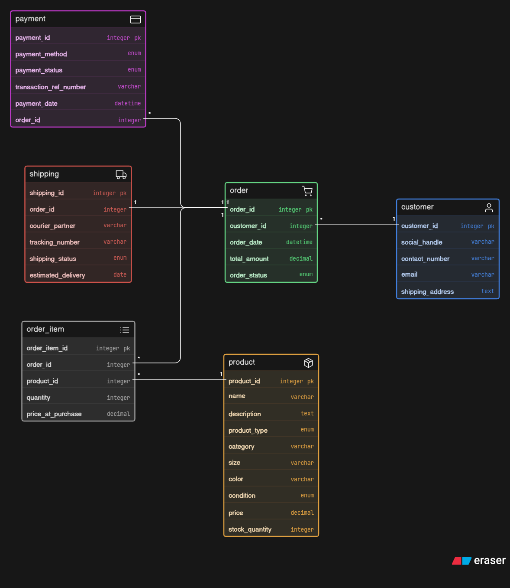

# Instagram-Thrift-Creator-Store-ER-Diagram

# 🛍️ Thrift & Handmade Store Database Design

## 📝 Overview

This database model is designed for a growing small business that sells a mix of **unique thrifted fashion items** and **handmade products**. The schema handles the transition from manual DM-based ordering to an organized system that tracks inventory, complex orders, payment attempts, and shipping logistics.

## 📊 Visual Representation


---

## 🗂️ Entity Breakdown

### 1. **Customer**

Stores essential buyer information. It includes a `social_handle` to bridge the gap between Instagram/WhatsApp interactions and formal database records.

- **Key Attribute:** `customer_id` (Primary Key).

### 2. **Product**

A hybrid inventory table that supports two distinct types of products:

- **Thrifted:** Unique pieces where `stock_quantity` is always 1.
- **Handmade:** Items produced in batches where `stock_quantity` can be multiple.
- **Condition:** Tracks the quality of thrifted items (New, Like New, Good, Fair).

### 3. **Order**

The "header" of a transaction. It tracks the overall status (e.g., Pending, Completed) and the total price, linking a specific customer to a purchase event.

### 4. **Order_Item (Junction Table)**

This table allows for **multiple products to be part of a single order**.

- **Historical Data:** It stores `price_at_purchase`. This is critical because if a handmade product's price changes in the future, the record of what the customer *actually* paid remains accurate.

### 5. **Payment**

Separated from the Order table to allow for multiple payment attempts (e.g., if a UPI transfer fails and the customer tries a Bank Transfer instead). It tracks the `transaction_ref_number` for manual verification.

### 6. **Shipping**

Handles logistics. It is separated to keep the Order table clean and focuses strictly on tracking numbers, courier partners, and delivery dates.

---

## 🔗 Relationships & Logic

**Customer → Order**One-to-Many (1:M)\
One customer can place many orders over time.

**Order → Order_Item**One-to-Many (1:M)\
One order can contain multiple different items.

**Product → Order_Item**One-to-Many (1:M)\
A product (especially handmade) can appear in many different orders.

**Order → Payment**One-to-Many (1:M)\
An order can have multiple payment attempts/records.

**Order → Shipping**One-to-One (1:1)\
One confirmed order typically results in one shipping shipment.

---

## 💻 Schema Representation ([Eraser.io](http://Eraser.io))

```dbml
customer [icon: user, color: blue] {
  customer_id integer pk
  social_handle varchar
  contact_number varchar
  email varchar
  shipping_address text
}

product [icon: package, color: orange] {
  product_id integer pk
  name varchar
  description text
  product_type enum
  category varchar
  size varchar
  color varchar
  condition enum
  price decimal
  stock_quantity integer
}

order [icon: shopping-cart, color: green] {
  order_id integer pk
  customer_id integer
  order_date datetime
  total_amount decimal
  order_status enum
}

order_item [icon: list, color: grey] {
  order_item_id integer pk
  order_id integer
  product_id integer
  quantity integer
  price_at_purchase decimal
}

payment [icon: credit-card, color: purple] {
  payment_id integer pk
  order_id integer
  payment_method enum
  payment_status enum
  transaction_ref_number varchar
  payment_date datetime
}

shipping [icon: truck, color: red] {
  shipping_id integer pk
  order_id integer
  courier_partner varchar
  tracking_number varchar
  shipping_status enum
  estimated_delivery date
}

// Relationships
order.customer_id > customer.customer_id
order_item.order_id > order.order_id
order_item.product_id > product.product_id
payment.order_id > order.order_id
shipping.order_id - order.order_id
```
